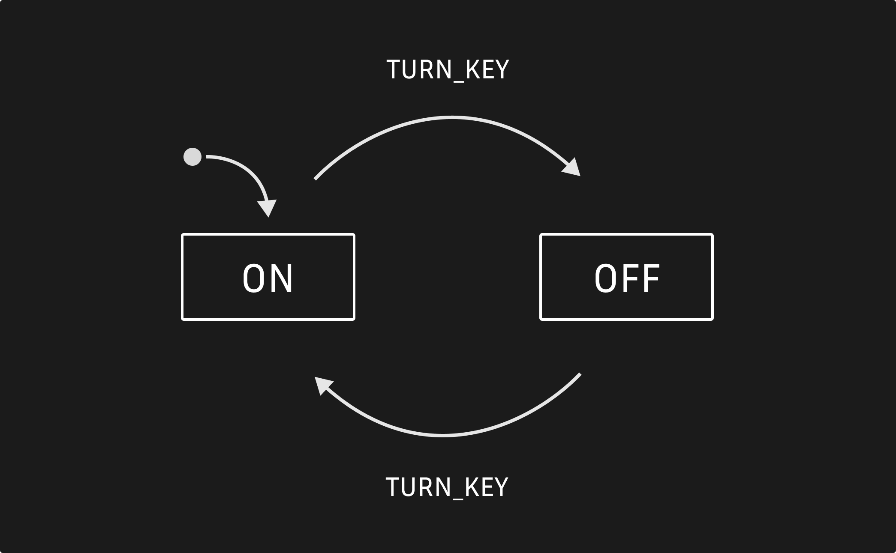

# ⚙ Motor

### A no-frills finite state machine module.

<br/>

[](https://github.com/sidiousvic/motor/actions)
[](https://github.com/sidiousvic/motor/blob/prod/LICENSE)
[](https://github.com/sidiousvic/motor/graphs/contributors)
[](https://github.com/sidiousvic/motor)
[](https://github.com/semantic-release/semantic-release)

<br/>

<br/>

## Start the motor

```ts
import { motor } from "https://deno.land/x/motor@0.0/mod.ts";

type Gears = "stopped" | "paused" | "playing" | "loading";

type Events = "SELECT" | "LOAD" | "PLAY" | "PAUSE" | "STOP";

const musicPlayerMotor: MotorSpec<Gears, Events> = {
  gear: "stopped",
  transmission: {
    stopped: {
      on: { LOAD: "loading" },
    },
    paused: {
      on: { PLAY: "playing", STOP: "stopped" },
    },
    loading: {
      on: { PLAY: "playing", STOP: "stopped" },
    },
    playing: {
      on: { PAUSE: "paused", STOP: "stopped" },
    },
  },
};

const { fire, gear } = motor(musicPlayer);

✅ assertEquals(gear(), "stopped");

fire("LOAD");

✅ assertEquals(gear(), "loading");

fire("PLAY");

✅ assertEquals(gear(), "playing");

fire("PAUSE");

✅ assertEquals(gear(), "paused");

fire("STOP");

✅ assertEquals(gear(), "stopped");
```

## Hook to changes in state

```ts
let counter = 0;

const count = () => (counter += 1);

const { fire, gear, hook } = motor(musicPlayerMotor);

✅ assertEquals(gear(), "stopped");

hook(count);

fire("LOAD");

✅ assertEquals(counter, 1);

fire("PLAY");

✅ assertEquals(counter, 2);

fire("STOP");

✅ assertEquals(counter, 3);
```

### 🧰 Development

Run tests:

```bash
deno test --allow-read
```

## 📄 License

MIT
